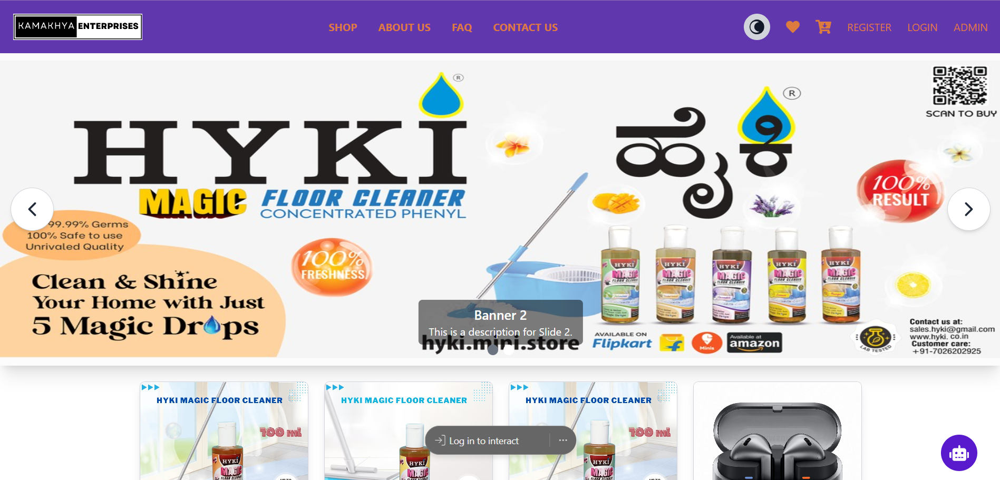

# E-Commerce Application

## Overview

This is a comprehensive **E-Commerce Platform** that provides a seamless shopping experience, including features like product management, user authentication, coupon system, cart and wishlist management, order tracking, FAQs, and more. The application is built with **Node.js**, **Express**, and **MongoDB** as the backend stack.

---

## Features

- **User Management**  
  - User Registration, Login, Logout  
  - Forgot Password, OTP Verification, and Password Reset  
  - Admin and User Role Authentication  

- **Product Management**  
  - Add, Update, Delete, and Fetch Products  
  - Wishlist Functionality  

- **Coupon System**  
  - Create, Update, and Apply Coupons  

- **Shopping Cart Management**  
  - Add/Remove Products from Cart  
  - Increment/Decrement Product Quantity  

- **Order Management**  
  - Create Orders, Track Orders, and View All Orders (Admin)  
  - Update Order Status  

- **FAQ and About Us Section**  
  - Manage FAQs and About Us information dynamically  

---

## API Routes

### **Authentication Routes** (`/api`)
- **POST** `/user/register` – Register a new user  
- **POST** `/user/login` – Login user  
- **POST** `/user/logout` – Logout user  
- **GET** `/user/loggedIn` – Check if user is logged in  
- **GET** `/user/adminLoggedIn` – Check if admin is logged in  
- **POST** `/user/forgetPassword` – Forgot password flow  
- **POST** `/user/verifyOtp` – Verify OTP for password reset  
- **POST** `/user/changePassword` – Change password  
- **GET** `/user` – Get all users (Admin)  
- **DELETE** `/user/:userId` – Delete a user by ID (Admin)  

---

### **Product Routes** (`/api/product`)
- **POST** `/` – Add a new product (Admin only)  
- **GET** `/getproduct` – Get all products  
- **GET** `/:id` – Get a single product by ID  
- **DELETE** `/deleteproduct/:id` – Delete a product by ID (Admin only)  
- **PUT** `/updateproduct/:id` – Update product details (Admin only)  
- **POST** `/addToWishList/:productId` – Add product to wishlist  

---

### **Cart Routes** (`/api/cart`)
- **POST** `/addSingleProduct` – Add a product to the cart  
- **DELETE** `/removeSingleProduct/:productId` – Remove a product from the cart  
- **GET** `/wishlist` – Get user’s wishlist  
- **POST** `/addToWishlist` – Add to wishlist  
- **DELETE** `/removeFromWishlist/:productId` – Remove from wishlist  
- **POST** `/decrement` – Decrease product quantity in cart  
- **POST** `/increment` – Increase product quantity in cart  
- **GET** `/` – Get user’s cart  

---

### **Coupon Routes** (`/api/coupons`)
- **POST** `/` – Create a new coupon  
- **GET** `/` – Get all coupons  
- **PUT** `/:id` – Update a coupon  
- **DELETE** `/:id` – Delete a coupon  
- **POST** `/apply` – Apply a coupon  
- **GET** `/public` – Get public coupons  

---

### **Order Routes** (`/api/orders`)
- **POST** `/createorder` – Create a new order  
- **GET** `/myorders` – Get orders of the logged-in user  
- **GET** `/all` – Get all orders (Admin)  
- **PATCH** `/:id` – Update order status (Admin)  

---

### **About Us Routes** (`/api/about`)
- **GET** `/` – Get About Us information  
- **PUT** `/` – Update About Us information  

---

### **FAQ Routes** (`/api/faqs`)
- **GET** `/` – Get all FAQs  
- **POST** `/` – Add a new FAQ  
- **PUT** `/:id` – Update a FAQ  
- **DELETE** `/:id` – Delete a FAQ  

---

## Project Setup

### Prerequisites
- Node.js (v14+)
- MongoDB (Atlas or Local)

### Installation

1. Clone the repository:
   intall: npm i
   cd e-commerce/backend : node index.js
   cd e-commerce/frontend : npm run dev

Hosted Link: https://ecommerce-two-jade.vercel.app/
